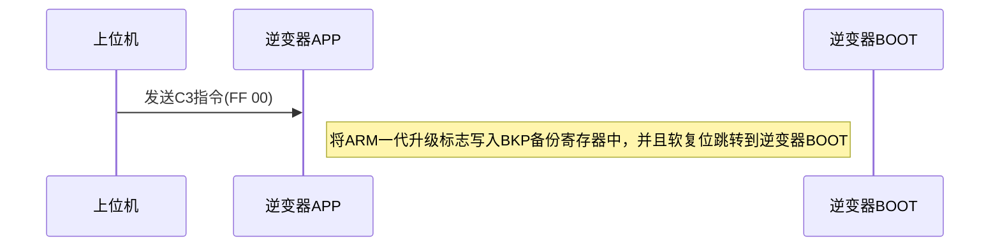

```mermaid
sequenceDiagram
    participant A as 上位机
    participant B as 逆变器APP
    participant C as 逆变器BOOT
    
    A->>B: 发送C3指令(FF 00)
    Note right of B: 将ARM一代升级标志写入BKP备份寄存器中，并且软复位跳转到逆变器BOOT

    
```